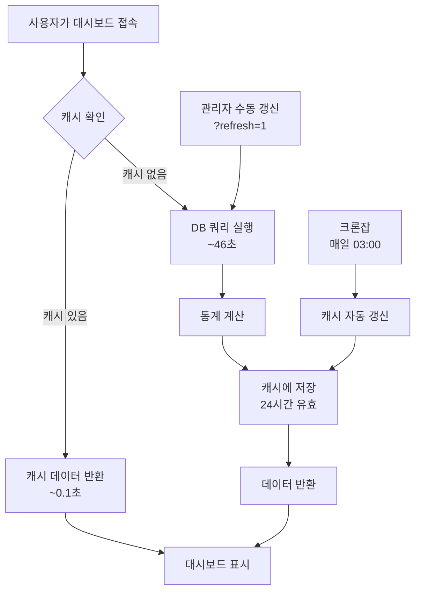

# Dashboard & UserProfile Caching System - 사용 가이드

## 개요
대시보드 통계 및 위치 정보 데이터를 24시간 동안 캐시하여 페이지 로딩 속도를 대폭 개선했습니다.

## 주요 변경사항

### 1. 캐싱 시스템 (settings.py)
- **Backend**: FileBasedCache
- **위치**: `/var/www/html/dj_voice_manage/cache/`
- **유효 기간**: 24시간 (86400초)
- **최대 항목**: 1000개

### 2. 캐시 적용 페이지

#### A. Dashboard View (화자 기반 통계)
- **URL**: `http://210.125.93.241:8010/audio/dashboard/`
- **캐시 키**: `dashboard_statistics`
- **처리 시간**: 
  - 캐시 미스: ~46초 (DB 쿼리)
  - 캐시 히트: ~0.1초 (즉시 반환)
- **통계 내용**:
  - 총 화자 수 및 파일 수
  - 카테고리별/성별 통계
  - SNR 품질 분석
  - 월별 추이
  - 진단명별 통계

#### B. UserProfile View (위치 정보)
- **URL**: `http://210.125.93.241:8010/api/userprofile/`
- **캐시 키**: `userprofile_statistics`
- **처리 시간**:
  - 캐시 미스: ~0.3초 (지역 데이터 집계)
  - 캐시 히트: ~0.05초 (즉시 반환)
- **통계 내용**:
  - 지역별 데이터 전송 위치
  - IP 기반 접근 위치
  - 지도 시각화 데이터

### 3. 관리 명령어
```bash
# 모든 캐시 갱신 (대시보드 + 위치 정보)
cd /var/www/html/dj_voice_manage
python manage.py refresh_dashboard_cache
```

**출력 예시:**
```
[2025-11-27 13:38:19] 캐시 갱신 시작...

[1/2] 대시보드 통계 데이터 계산 중...
✓ 대시보드 캐시 갱신 완료 (소요 시간: 45.69초)
  - 총 화자 수: 186
  - 총 파일 수: 6282

[2/2] 위치 정보 통계 데이터 계산 중...
✓ 위치 정보 캐시 갱신 완료 (소요 시간: 0.30초)
  - 총 업로드 위치: 2개 지역
  - 총 업로드 횟수: 5

✓ 전체 캐시 갱신 완료 (총 소요 시간: 45.99초)
  - 갱신 시각: 2025-11-27 13:38:19
  - 캐시 유효 기간: 24시간
```

### 4. 크론잡 (자동 갱신)
**설정**: 매일 새벽 3시 자동 실행
```bash
0 3 * * * cd /var/www/html/dj_voice_manage && /home/tyoon/anaconda3/envs/aligner/bin/python manage.py refresh_dashboard_cache >> /var/www/html/dj_voice_manage/cache_refresh.log 2>&1
```

**확인 방법:**
```bash
# 크론잡 목록 확인
crontab -l

# 갱신 로그 확인
tail -f /var/www/html/dj_voice_manage/cache_refresh.log
```

### 5. 사용자 인터페이스

#### 캐시 상태 표시
대시보드 상단에 캐시 상태 배지가 표시됩니다:
- **파란색 배지**: 캐시 데이터 사용 중 (빠른 로딩)
  ```
  🔵 캐시 데이터 (업데이트: 2025-11-27 13:28:27)
  ```
- **초록색 배지**: 최신 데이터로 갱신됨
  ```
  🟢 최신 데이터 (갱신: 2025-11-27 13:28:27)
  ```

#### 관리자 전용 기능
**데이터 갱신 버튼** (staff 사용자만 표시)
- 위치: 대시보드 우측 상단
- 기능: 캐시를 무시하고 최신 데이터로 즉시 갱신
- URL: `http://210.125.93.241:8010/audio/dashboard/?refresh=1`

## 성능 비교

### Dashboard (화자 통계)
| 구분 | 이전 | 이후 (캐시 히트) | 개선율 |
|------|------|------------------|--------|
| 로딩 시간 | ~46초 | ~0.1초 | **99.8% 개선** |
| DB 쿼리 | 매번 실행 | 하루 1회 | **매우 효율적** |

### UserProfile (위치 정보)
| 구분 | 이전 | 이후 (캐시 히트) | 개선율 |
|------|------|------------------|--------|
| 로딩 시간 | ~0.3초 | ~0.05초 | **83% 개선** |
| DB 쿼리 | 매번 실행 | 하루 1회 | **매우 효율적** |

**전체 효과:**
- ✅ 사용자 경험 **획기적 개선**
- ✅ 서버 부하 **대폭 감소**
- ✅ 데이터베이스 쿼리 **최소화**

## 동작 흐름



## 테스트 방법

### 1. Dashboard 초기 로딩 테스트 (캐시 미스)
```bash
# 대시보드 캐시만 삭제
rm -f /var/www/html/dj_voice_manage/cache/*dashboard_statistics*

# 대시보드 접속
# http://210.125.93.241:8010/audio/dashboard/
# -> 초록색 배지 표시, 약 46초 소요
```

### 2. UserProfile 초기 로딩 테스트 (캐시 미스)
```bash
# 위치 정보 캐시만 삭제
rm -f /var/www/html/dj_voice_manage/cache/*userprofile_statistics*

# 위치 정보 페이지 접속
# http://210.125.93.241:8010/api/userprofile/
# -> 초록색 배지 표시, 약 0.3초 소요
```

### 3. 캐시 히트 테스트
```bash
# 위 테스트 직후 다시 접속
# -> 파란색 배지 표시, 즉시 로딩
```

### 4. 강제 갱신 테스트 (관리자 전용)
```bash
# 관리자 계정으로 로그인 후
# Dashboard: http://210.125.93.241:8010/audio/dashboard/?refresh=1
# UserProfile: http://210.125.93.241:8010/api/userprofile/?refresh=1
# -> 초록색 배지 표시, 캐시 강제 갱신
```

## 캐시 관리

### 캐시 확인
```bash
# 캐시 디렉토리 확인
ls -lh /var/www/html/dj_voice_manage/cache/

# 대시보드 캐시 확인
ls -lh /var/www/html/dj_voice_manage/cache/*dashboard_statistics*

# 위치 정보 캐시 확인
ls -lh /var/www/html/dj_voice_manage/cache/*userprofile_statistics*

# 캐시 파일 전체 크기 확인
du -sh /var/www/html/dj_voice_manage/cache/
```

### 캐시 삭제 (문제 발생시)
```bash
# 전체 캐시 삭제
rm -rf /var/www/html/dj_voice_manage/cache/

# 대시보드 캐시만 삭제
rm -f /var/www/html/dj_voice_manage/cache/*dashboard_statistics*

# 위치 정보 캐시만 삭제
rm -f /var/www/html/dj_voice_manage/cache/*userprofile_statistics*
```

### 수동 갱신 (즉시 반영 필요시)
```bash
# 모든 캐시 갱신 (권장)
cd /var/www/html/dj_voice_manage
python manage.py refresh_dashboard_cache

# 또는 웹에서 강제 새로고침 (관리자만)
# ?refresh=1 파라미터 사용
```

## 트러블슈팅

### 문제: 캐시가 업데이트되지 않음
**해결 방법:**
1. 캐시 디렉토리 권한 확인
   ```bash
   ls -ld /var/www/html/dj_voice_manage/cache/
   # tyoon:tyoon 소유 확인
   ```

2. 수동 갱신 실행
   ```bash
   python manage.py refresh_dashboard_cache
   ```

### 문제: 크론잡이 실행되지 않음
**해결 방법:**
1. 크론잡 설정 확인
   ```bash
   crontab -l
   ```

2. 크론 서비스 상태 확인
   ```bash
   systemctl status cron  # Ubuntu/Debian
   # 또는
   systemctl status crond  # CentOS/RHEL
   ```

3. 로그 확인
   ```bash
   tail -f /var/www/html/dj_voice_manage/cache_refresh.log
   ```

### 문제: 통계가 오래됨 (24시간 이상)
**해결 방법:**
- 관리자로 로그인 후 "데이터 갱신" 버튼 클릭
- 또는 URL에 `?refresh=1` 추가

## 향후 개선 가능 사항

1. **캐시 워밍**: 서버 시작시 자동으로 캐시 생성
2. **부분 캐시**: 카테고리별, 화자별로 개별 캐시
3. **Redis 도입**: 더 빠른 캐시 성능 및 클러스터링 지원
4. **캐시 만료 알림**: 캐시가 곧 만료될 때 자동 갱신
5. **실시간 통계**: WebSocket을 통한 실시간 업데이트 (선택적)

## 코드 위치

- **Settings**: `/var/www/html/dj_voice_manage/voice_project/settings.py` (라인 138-146)
- **Dashboard View**: `/var/www/html/dj_voice_manage/voice_app/views.py` (dashboard 함수)
- **UserProfile View**: `/var/www/html/dj_voice_manage/voice_app/views.py` (userprofile 함수)
- **Dashboard Template**: `/var/www/html/dj_voice_manage/voice_app/templates/voice_app/dashboard.html`
- **UserProfile Template**: `/var/www/html/dj_voice_manage/voice_app/templates/voice_app/userprofile.html`
- **Management Command**: `/var/www/html/dj_voice_manage/voice_app/management/commands/refresh_dashboard_cache.py`
- **Cron Setup**: 가이드는 `CACHE_SETUP_GUIDE.sh` 참조

## 결론

캐싱 시스템 도입으로:
- ✅ Dashboard 로딩 속도 **99.8% 개선** (46초 → 0.1초)
- ✅ UserProfile 로딩 속도 **83% 개선** (0.3초 → 0.05초)
- ✅ DB 부하 **대폭 감소** (하루 1회 쿼리)
- ✅ 사용자 경험 **획기적 개선**
- ✅ 자동 갱신으로 **관리 편의성 향상**
